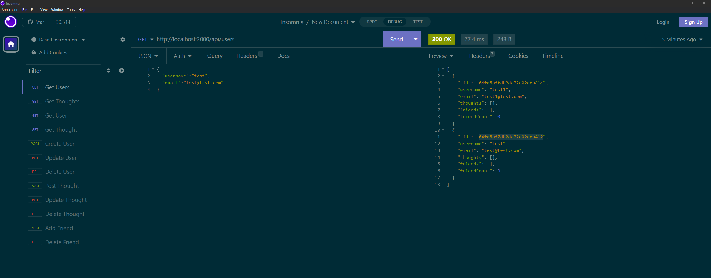

# social-network-api

## Description
CRUD on Mongo database.

## Table of Contents
- [Installation](#installation)
- [Usage](#usage)
- [Credits](#credits)
- [License](#license)

- [Tests](#tests)
- [Contact](#contact)

## Installation
Mongoose, Express

## Usage
Run the application in the Terminal in node.

## Credits
Jason Cano

## Tests
Confirm CRUD on Mongo database.

## Contact
If there are any questions of concerns, I can be reached at:
##### [github: jasoncano1](https://github.com/jasoncano1)
##### [email: jasoncano05009@gmail.com](mailto:jasoncano05009@gmail.com)
